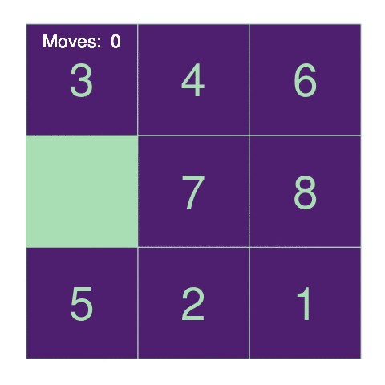

<!-- README.md is generated from README.Rmd. Please edit that file -->

```{r, echo = FALSE}
knitr::opts_chunk$set(
  collapse = TRUE,
  comment = "#>",
  fig.path = "README/README-fig",
  cache.path = "README/README-cache-",
  warning = FALSE,
  message = FALSE,
  cache = FALSE
)
```

# puzzlr

The `puzzlr` package implements square puzzles with numbered tiles where the goal is to get the tiles in order by sliding them. My hope is that this will come in handy for demonstrating or learning about different algorithms for solving the puzzles. 

## Installation

You can install puzzlr from github with:

```{r gh-installation, eval = FALSE}
# install.packages("devtools")
devtools::install_github("tarakc02/puzzlr")
```

## Generating puzzles

```{r, cache = FALSE}
library(puzzlr)
```

You can create a puzzle manually:

```{r}
# manually specify:
puzzle(c(
    4,6,3,
    7,2,0,
    1,8,5
))
```

Or generate a random puzzle:

```{r}
random_puzzle(size = 4)
```

## Puzzle Methods

To visualize a puzzle:

```{r}
set.seed(5476)
demo <- random_puzzle(size = 5)
plot(demo)
```

To move a tile, specify the source and the destination:

```{r}
# move the "13" down:
after_move <- move(demo, source = c(2, 4), dest = c(3, 4))
after_move
```

Puzzles "remember" their move history by pointing to their "parent" -- that is, the puzzle state from which they came (the parent of a newly generated puzzle is `NULL`):

```{r}
# number of moves made so far:
moves(after_move)

# the previous state:
parent(after_move)
```

A state reachable from a given puzzle state is called a "neighbor" of that puzzle state, and the `neighbors` function generates all neighbors:

```{r}
neighbors(demo)
```

For convenience, two distance metrics have been implemented, the `hamming` and `manhattan` distance. The `manhattan` distance is the sum of each non-zero tile's manhattan distance to its goal position, and the `hamming` distance is the sum of each non-zero tile's hamming distance to its goal position. These can both be used as lower bounds on the number of moves required to solve the puzzle. 

```{r}
manhattan(demo)
hamming(demo)
```

## Solving puzzles

```{r}
set.seed(46654)
mypuzzle <- random_puzzle(3)
is_solvable(mypuzzle)
```

As stated above, the hope for this package is for it to serve as an easy-to-use framework against which to experiment with solver algorithms. As an example, I'll show how to solve a puzzle using [lazily evaluated lists](https://github.com/tarakc02/lazylist).

The idea is to generate every state that is reachable from the starting puzzle. Recall that every move keeps track of the history of moves that got from the original puzzle to the current state. So once I've generated every single reachable state, I just search through and find one that is in the goal state. Of course, the big problem is that there will be far too many such states. So I make sure that I evaluate them in order, where I order them by the number of moves needed to reach the state plus the manhattan distance from the goal state. Then I just scan one-by-one until I reach a solved state -- because of the way I'm ordering things, this will also represent the fastest solution. 

```{r}
library(lazylist)
reachable_states <- function(pz) {
    # to generate all reachable states, i first look at
    # all states reachable in 1 move
    possible_moves <- neighbors(pz)
    
    # then i generate a stream of further moves from each of those states
    stream_of_moves <- function(x) cons_stream(x, reachable_states(x))
    streams <- purrr::map(possible_moves, stream_of_moves)
    
    # finally, i interleave the streams of future moves, 
    # ordering in such a way that i'm guaranteed to stumble into
    # the shortest solution:
    purrr::reduce(streams, 
                  merge_weighted, 
                  weight = function(x) moves(x) + manhattan(x))
}

mypuzzle_moves <- reachable_states(mypuzzle)

# if a set of moves results in manhattan (or hamming) distance of 0 
# that means it represents a valid solution to the puzzle
valid_solutions <- stream_filter(mypuzzle_moves,
                                 function(x) manhattan(x) == 0)

# the first solution in the stream will be the one that required the 
# fewest moves:
mysolution <- valid_solutions[1]
```

To view how many moves were required by a given solution:

```{r}
moves(mysolution)
```

You can animate the results:

```{r animate, echo = FALSE}
if (!file.exists("README/README-fig-animated-solution.gif"))
    animate_moves(mysolution,  
                  filename = "README/README-fig-animated-solution.gif")
```

```{r, eval = FALSE}
animate_moves(mysolution)
```


